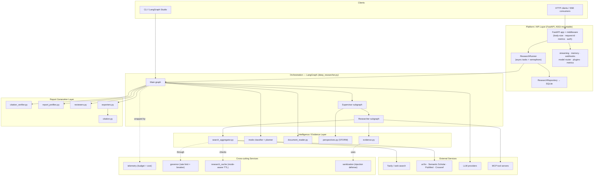
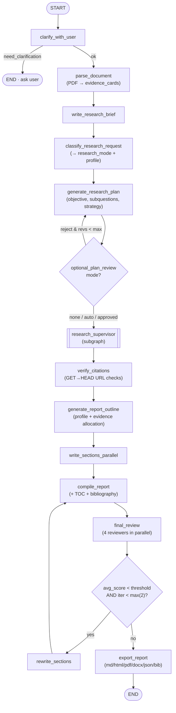
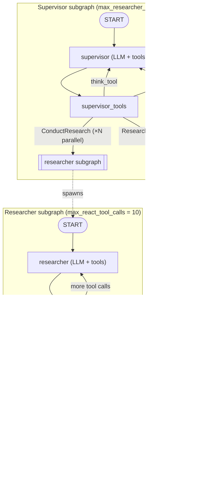
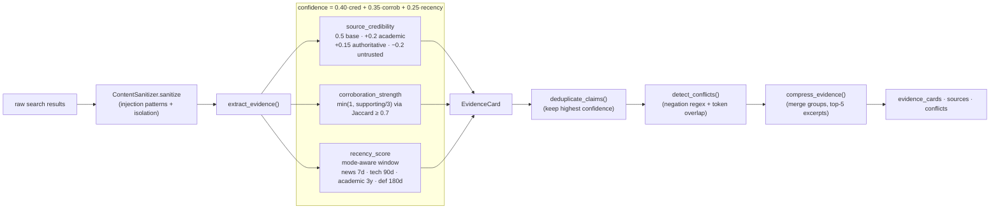
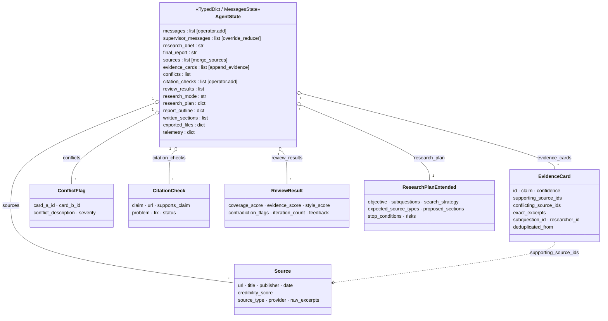
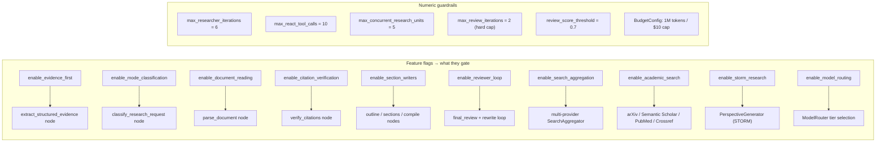
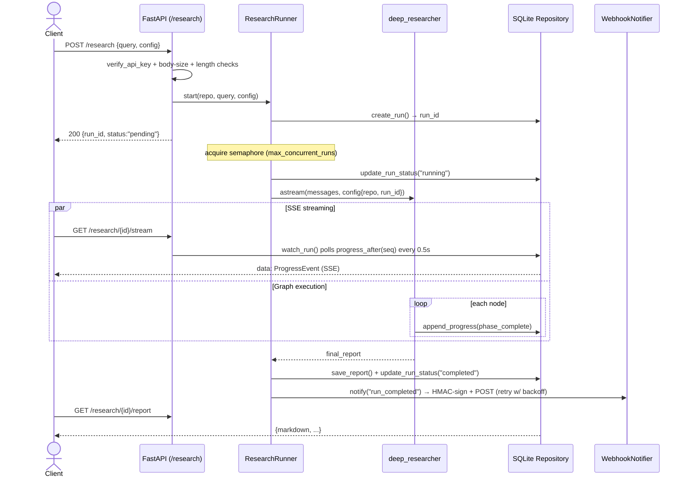
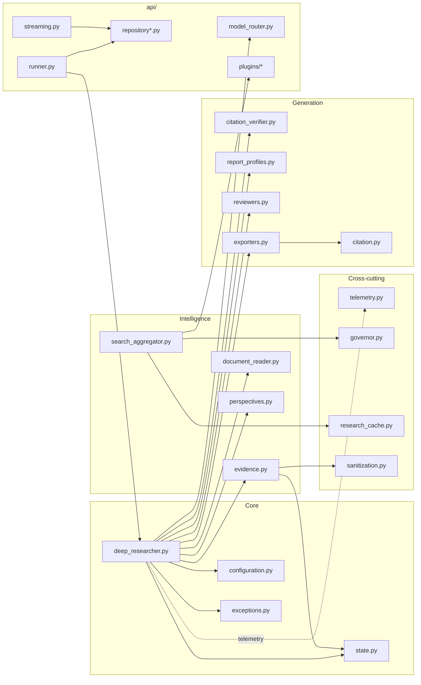

# Advanced Deep Research

A production-grade deep research agent that autonomously investigates complex questions, verifies sources, and generates structured reports with citations, evidence cards, and multi-format export.

Built on LangGraph's `open_deep_research` — extended with evidence-first architecture, citation verification, adaptive research strategies, quality assurance review loops, and a REST API.

---

## Features

- **Multi-provider search** — Tavily, DuckDuckGo, arXiv, Semantic Scholar, PubMed, Crossref
- **Evidence extraction** — Structured evidence cards with deterministic confidence scoring (source credibility × corroboration × recency)
- **Citation verification** — HTTP checks verify sources are alive; dead links trigger fallback search
- **Adaptive research strategies** — 9 research modes (comparison, market landscape, academic review, etc.) with auto-classification
- **Agentic document reading** — PDF parsing with section-by-section LLM interrogation (no vector DB)
- **Multi-perspective research** — STORM-style parallel researchers across customer/investor/regulator/etc. lenses
- **8 report profiles** — Executive brief, deep research report, academic literature review, investment memo, competitive landscape, technical design, policy memo, news brief
- **6 citation styles** — APA, MLA, Chicago, Harvard, IEEE, vanilla + BibTeX export
- **Parallel section writers** — Structured section generation with conflict-aware writing
- **QA reviewer loop** — 4 parallel reviewers (coverage, evidence, contradiction, style) with auto-rewrite
- **Multi-format export** — Markdown, HTML, PDF, DOCX, JSON
- **REST API** — FastAPI server with SSE progress streaming, webhooks, cross-session memory, API key auth
- **Observability** — Prometheus metrics endpoint, LangSmith tracing, and centralized leveled logging (colored console + daily-rotating file, with JSON/`request_id` mode for aggregators)
- **Security** — Prompt injection defense (56 patterns), rate limiting, circuit breakers, input validation
- **Model routing** — 3-tier model selection (fast/balanced/quality) per task type for cost optimization

---

## Quickstart

```bash
# Prerequisites: Python 3.11+, uv

# 1. Clone and enter the directory
git clone <repo-url>
cd open_deep_research

# 2. Create virtual environment and install
uv venv --python 3.11 .venv
uv pip install -e ".[dev]"

# 3. Configure API keys (at minimum: one LLM + one search provider)
cp .env.example .env

# 4. Verify installation
.venv/bin/python -c "from open_deep_research.deep_researcher import deep_researcher; print('OK')"

# 5. Run tests
.venv/bin/python -m pytest tests/ -x -q
```

---

## Usage

### LangGraph Studio (Web UI)

```bash
uvx langgraph dev
```
Opens a visual graph editor at `http://localhost:2024` — type a query, step through nodes, inspect state.

### REST API

```bash
ENABLE_REST_API=true API_KEY=your-key .venv/bin/python -m open_deep_research.api.main

# Start research
curl -X POST http://localhost:8000/research \
  -H "Content-Type: application/json" \
  -H "X-API-Key: your-key" \
  -d '{"query": "Latest advances in transformer architectures"}'

# Stream progress (SSE)
curl -N http://localhost:8000/research/{run_id}/stream

# Get report
curl http://localhost:8000/research/{run_id}/report

# Export
curl http://localhost:8000/research/{run_id}/export/markdown

# Metrics
curl localhost:8000/metrics
```

### Python SDK

```python
import asyncio
from open_deep_research.deep_researcher import deep_researcher

async def main():
    result = await deep_researcher.ainvoke(
        {"messages": [{"role": "user", "content": "Compare React vs Vue for enterprise apps"}]},
        config={
            "configurable": {
                "research_model": "google_genai:gemini-2.5-flash",
                "search_api": "tavily",
            }
        }
    )
    print(result.get("final_report", ""))

asyncio.run(main())
```

### Full Verification

```bash
# Lint + dependency audit + tests with coverage
bash scripts/verify.sh
```

---

## Architecture

### System Overview

The platform is layered: a FastAPI platform layer drives a LangGraph orchestration core, which in
turn calls the intelligence (evidence) and report-generation layers. Cross-cutting services —
telemetry, the rate-limit governor, caching, and input sanitization — wrap the orchestration core
rather than sitting in the linear flow.



### Research Pipeline

The research pipeline is a LangGraph with 19 nodes. Diamonds are conditional edges; the
`research_supervisor` node is a subgraph (see below).



### Research Graph Nodes

| Phase | Nodes | Description |
|-------|-------|-------------|
| Planning | clarify, parse, brief, classify, plan, review | Understand query, classify mode, generate subquestions |
| Research | supervisor, researchers | Parallel multi-provider search across NC researchers |
| Evidence | extract_evidence, compress | Build evidence cards, dedup, detect conflicts |
| Verification | verify_citations | HTTP check every source URL |
| Generation | outline, section_writers, compile | Profile-aware section writing with citation formatting |
| Review | final_review, rewrite_sections | 4 parallel reviewers (coverage/evidence/contradiction/style) |
| Export | export_report | Markdown, HTML, PDF, DOCX, JSON |

### Supervisor & Researcher Subgraphs

The `research_supervisor` node delegates `ConductResearch` calls to parallel researcher subgraphs
(up to `max_concurrent_research_units`, default 5). Each researcher runs a ReAct tool loop, then
compresses and extracts structured evidence.



### Evidence & Confidence Scoring

Raw search results become scored, deduplicated, conflict-flagged evidence cards. The confidence
score is computed **programmatically** — never self-reported by the LLM.



### State Model

The top-level LangGraph state is a `TypedDict`; Pydantic models are stored as dicts and
reconstructed when needed. Custom reducers (`merge_sources`, `append_evidence`, `override_reducer`)
govern how concurrent updates merge.



> A standalone reference with all of these diagrams collected in one place lives in
> [`docs/architecture-diagrams.md`](docs/architecture-diagrams.md).

---

## Configuration

Key settings in `src/open_deep_research/configuration.py`. Configurable via `.env`, environment variables, or LangGraph Studio.

### Model Settings

| Setting | Default | Description |
|---------|---------|-------------|
| `research_model` | `openai:gpt-4.1` | Model for research |
| `compression_model` | `openai:gpt-4.1` | Model for compression |
| `final_report_model` | `openai:gpt-4.1` | Model for report writing |
| `search_api` | `tavily` | Search provider |

### Feature Flags

| Setting | Default | Description |
|---------|---------|-------------|
| `enable_citation_verification` | `true` | HTTP-check citations |
| `enable_section_writers` | `true` | Parallel section generation |
| `enable_reviewer_loop` | `true` | QA review + auto-rewrite |
| `enable_evidence_first` | `true` | Evidence-card architecture |
| `enable_model_routing` | `false` | Multi-tier model routing |

Each flag gates a specific node or component, with a legacy fallback preserved when it is off.
Numeric guardrails bound cost and latency regardless of flags.



### Report Profiles

| Profile | Best for |
|---------|----------|
| `executive_brief` | Concise summary with key findings |
| `deep_research_report` | Comprehensive multi-section report |
| `academic_literature_review` | Systematic literature review |
| `investment_memo` | Investment analysis with risk assessment |
| `competitive_landscape` | Competitive analysis |
| `technical_design_research` | Technical architecture research |
| `policy_memo` | Policy analysis |
| `news_brief` | Timely news summary |

### Logging

Logging is configured centrally by `logging_config.setup_logging()` (built on the
vendored `pretty_logger`). It is wired at both entry points — the API server and
`deep_researcher` import — so library, LangGraph Studio, and REST usage all get the
same output. Every module logs through the standard `logging.getLogger(__name__)`
pattern; handlers are attached once to the `open_deep_research` package logger.

Two sinks are always active:
- **Console** — colored by level when stdout is a TTY (auto-plain otherwise).
- **File** — plain text at `LOG_DIR/applog.log`, rotated daily, kept for 30 days.
  Best-effort: a read-only filesystem disables the file sink with a warning instead
  of crashing.

Controlled entirely by environment variables:

| Variable | Default | Description |
|----------|---------|-------------|
| `LOG_LEVEL` | `INFO` | `DEBUG` / `INFO` / `WARNING` / `ERROR` / `CRITICAL` |
| `LOG_DIR` | `logs` | Directory for the rotating file log |
| `LOG_FORMAT` | auto | `color`, `plain`, or `json` (structured, for Loki/Datadog/etc.) |
| `NO_COLOR` | unset | If set, forces plain console ([no-color.org](https://no-color.org)) |

In `json` mode each line includes a `request_id`, populated per-request by the API
middleware, so a single request can be traced across every module.

```bash
# Verbose colored dev logs
LOG_LEVEL=DEBUG LOG_FORMAT=color uvx langgraph dev

# Structured logs for a container/aggregator
LOG_LEVEL=INFO LOG_FORMAT=json LOG_DIR=/var/log/odr ENABLE_REST_API=true \
  API_KEY=... .venv/bin/python -m open_deep_research.api.main
```

---

## API Endpoints

| Method | Path | Auth Scope | Description |
|--------|------|------------|-------------|
| `POST` | `/research` | `research:write` | Start research |
| `GET` | `/research/{id}` | `research:read` | Get run status |
| `GET` | `/research/{id}/stream` | `research:read` | SSE progress stream |
| `GET` | `/research/{id}/report` | `research:read` | Get final report |
| `GET` | `/research/{id}/export/{fmt}` | `research:read` | Export report |
| `POST` | `/research/{id}/cancel` | `research:write` | Cancel run |
| `GET` | `/memory` | `research:read` | List saved topics |
| `GET` | `/memory/{hash}` | `research:read` | Load saved research |
| `POST` | `/memory/feedback` | `research:write` | Save preference |
| `POST` | `/webhooks` | `admin` | Register webhook |
| `GET` | `/webhooks` | `admin` | List webhooks |
| `DELETE` | `/webhooks/{id}` | `admin` | Remove webhook |
| `GET` | `/plugins` | `admin` | List plugins |
| `GET` | `/health` | none | Health check |
| `GET` | `/metrics` | none | Prometheus metrics |

### Request Lifecycle

A research run executes in the background. The client receives a `run_id` immediately, then follows
progress over SSE while the graph runs and a webhook fires on completion.



---

## Project Structure

```
src/open_deep_research/
├── deep_researcher.py       # 19-node LangGraph
├── configuration.py         # All settings + feature flags
├── state.py                 # State + Pydantic models
├── evidence.py              # Evidence extraction engine
├── citation_verifier.py     # HTTP citation verification
├── report_profiles.py       # 8 report profiles
├── citation.py              # 6 citation styles + BibTeX
├── exporters.py             # Multi-format export
├── reviewers.py             # 4 QA reviewers
├── search_aggregator.py     # Multi-provider search
├── document_reader.py       # PDF parsing
├── perspectives.py          # STORM multi-perspective
├── sanitization.py          # Injection defense
├── governor.py              # Rate limiting
├── telemetry.py             # Cost tracking
├── research_cache.py        # Mode-aware caching
├── exceptions.py            # Exception hierarchy
├── logging_config.py        # Centralized logging setup (levels, formats, rotation)
├── _vendor/                 # Vendored third-party (pretty_logger, upstream snapshot)
└── api/                     # REST API server
    ├── main.py              # FastAPI app
    ├── repository.py        # Persistence ABC
    ├── repository_sqlite.py # SQLite backend
    ├── runner.py            # Background execution
    ├── streaming.py         # SSE streaming
    ├── memory.py            # Cross-session memory
    ├── webhooks.py          # Webhook notifications
    ├── model_router.py      # Multi-model routing
    ├── metrics.py           # Prometheus metrics
    ├── plugins/             # Source plugin system
    └── routes/              # Route handlers
```

### Module Dependencies

How the modules above depend on one another. `deep_researcher.py` is the hub; the `api/` package
wraps it for background/HTTP execution.



---

## Design Principles

- **Evidence-first:** Every claim backed by structured evidence with deterministic confidence scores — not LLM self-reports
- **No vector-RAG:** Agentic document reading via section-by-section LLM interrogation; no chunking or embeddings
- **Conflict-aware:** Contradictory claims are presented explicitly, never averaged into false consensus
- **Feature-flagged:** All new components behind configuration flags with preserved legacy fallback paths
- **Observable by default:** LangSmith tracing, Prometheus metrics, structured logging on every API request

---

## License

MIT — see `LICENSE`. Original `open_deep_research` Copyright (c) 2025 LangChain.
