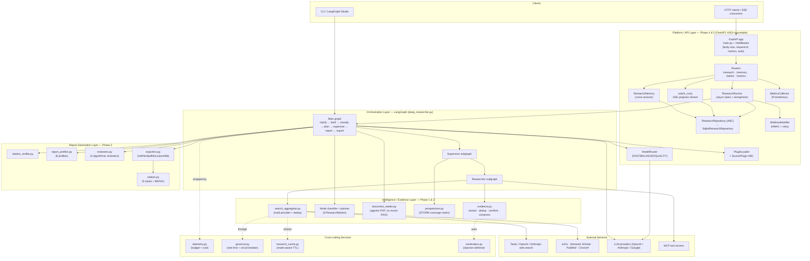
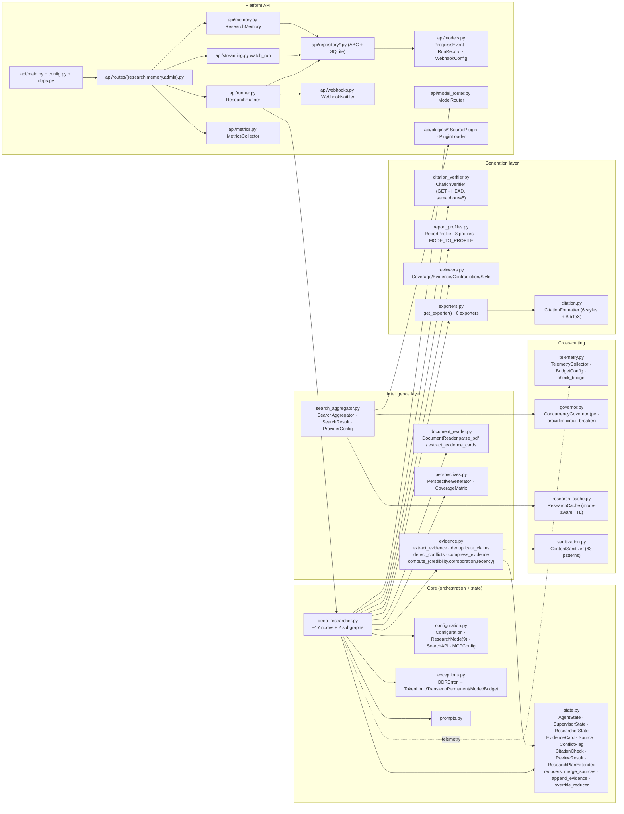
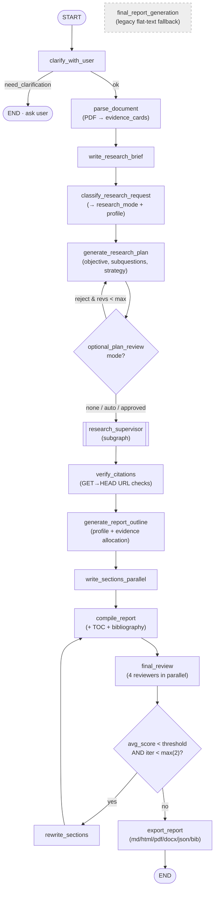
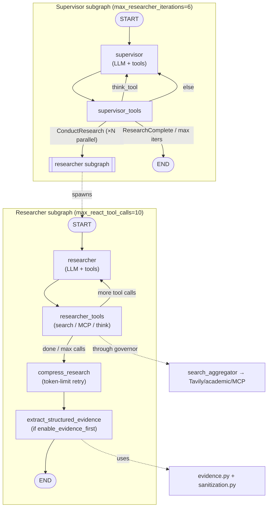
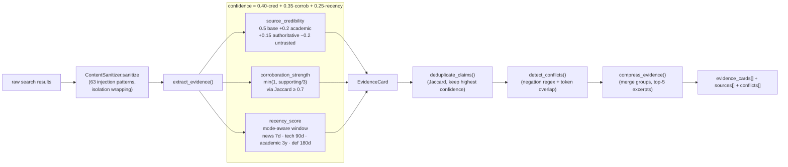
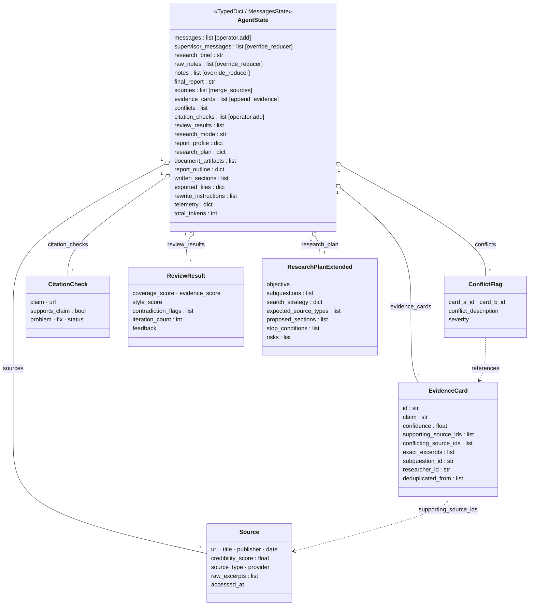
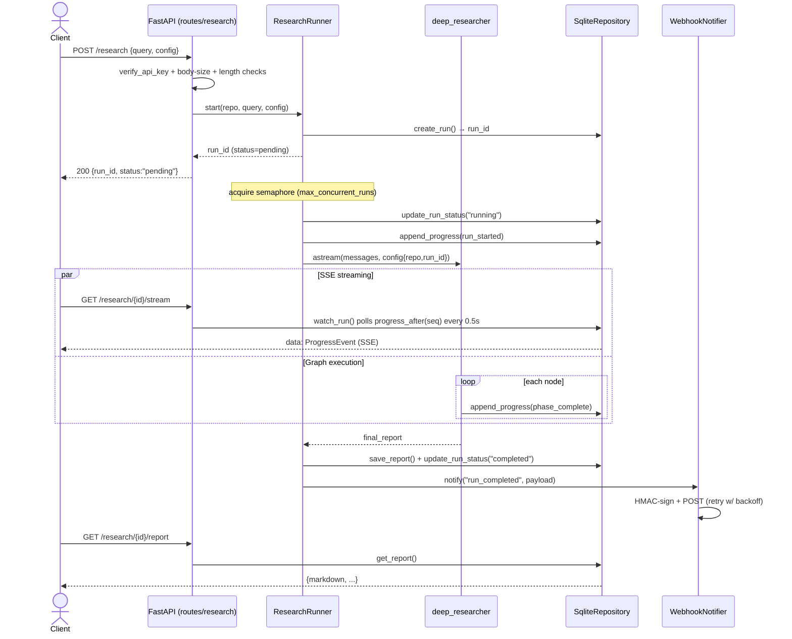
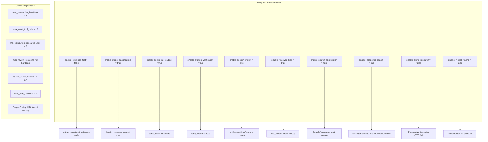

# Advanced Deep Research — Architecture, Implementation & Workflow Diagrams

> All diagrams use [Mermaid](https://mermaid.js.org/) and render natively on GitLab/GitHub, in
> VS Code (Markdown Preview Mermaid), JetBrains, and at <https://mermaid.live>.
>
> Scope: the enhanced LangChain `open_deep_research` (ODR) platform —
> evidence-first research, adaptive strategies, QA loops, report profiles, and the platform API.
> Source: `open_deep_research/src/open_deep_research/`. Last mapped: 2026-06-24.

---

## Table of Contents

1. [System Architecture (layered)](#1-system-architecture)
2. [Component / Implementation Diagram](#2-component--implementation-diagram)
3. [Workflow Diagram — the LangGraph pipeline](#3-workflow-diagram--the-langgraph-pipeline)
4. [Sub-workflows: Supervisor & Researcher subgraphs](#4-sub-workflows-supervisor--researcher-subgraphs)
5. [Evidence confidence pipeline (data flow)](#5-evidence-confidence-pipeline)
6. [State & data model (class diagram)](#6-state--data-model)
7. [Platform API request lifecycle (sequence)](#7-platform-api-request-lifecycle)
8. [Feature flags & configuration map](#8-feature-flags--configuration-map)
9. [Key design decisions](#9-key-design-decisions)

---

## 1. System Architecture

Layered view of the whole platform. Cross-cutting services (telemetry, governor, cache,
sanitization) wrap the orchestration layer rather than sitting in the linear flow.

---

## 2. Component / Implementation Diagram

Module-level map showing concrete classes/functions per file and how they depend on each other.

---

## 3. Workflow Diagram — the LangGraph pipeline

End-to-end runtime flow through the main graph, including the clarification early-exit, the
research subgraph, and the reviewer rewrite loop. Diamonds are conditional edges.

> The Phase-3 report path (`verify_citations` → … → `export_report`) is active when
> `enable_section_writers` is on. With evidence-first/section-writers disabled, the graph falls
> back to the legacy `final_report_generation` node (dashed).

---

## 4. Sub-workflows: Supervisor & Researcher subgraphs

The supervisor delegates `ConductResearch` calls to parallel researcher subgraphs
(`max_concurrent_research_units`, default 5). Each researcher runs a ReAct loop, compresses, and
extracts structured evidence.

---

## 5. Evidence confidence pipeline

How raw search results become scored, deduplicated, conflict-flagged EvidenceCards. The
confidence score is computed **programmatically**, never self-reported by the LLM.

---

## 6. State & data model

The top-level LangGraph state is a `TypedDict`; Pydantic models are stored as dicts and
reconstructed when needed. Custom reducers govern how concurrent updates merge.

---

## 7. Platform API request lifecycle

Sequence for a research run submitted over HTTP, including background execution, SSE streaming,
webhook delivery, and persistence.

---

## 8. Feature flags & configuration map

Every enhancement is gated by a flag in `Configuration` with a legacy fallback. Default values
shown; the kill switch resets Phase 2+ flags in <30s.

---

## 9. Key design decisions

| Decision | Rationale |
|----------|-----------|
| **Evidence-first** | Structured `EvidenceCard`s with deterministic confidence replace flat-text compression — claim-level citations and corroboration tracking. |
| **No vector-RAG** | Agentic, section-by-section document interrogation (`document_reader.py`) instead of chunking/embeddings. Non-negotiable per plan. |
| **Deterministic confidence** | `0.40·credibility + 0.35·corroboration + 0.25·recency`, computed in code — never LLM self-reported. |
| **Conflict presentation** | Contradictions surfaced explicitly ("Source A claims X, Source B argues Y"); never averaged into false consensus. |
| **Feature flags + legacy fallback** | Every new component behind a flag; `final_report_generation` legacy path always preserved; <30s kill switch. |
| **TypedDict state, Pydantic values** | LangGraph reducers need dict state; Pydantic models stored as dicts and reconstructed on use. |
| **Reviewer loop hard cap** | Max 2 rewrite iterations — fixed latency/cost guardrail. |
| **Citation rule** | GET-first (not HEAD); bot-blocked URLs tagged `unverified` (not re-researched); only `dead` URLs trigger fallback. |
| **Cross-cutting governor/telemetry/cache** | Rate-limit circuit breaker, budget enforcement, and mode-aware caching wrap external calls rather than living in the linear flow. |
| **Platform API is ASGI-mountable** | FastAPI app with SQLite repository, SSE streaming, HMAC webhooks, and Prometheus metrics — mountable into a larger ASGI app. |

---

*Generated from a structured read of the ODR source tree. To regenerate after code changes, re-map
`deep_researcher.py` (nodes/edges), `state.py` (models/reducers), `configuration.py` (flags), and the
`api/` package, then update the affected diagram blocks.*
